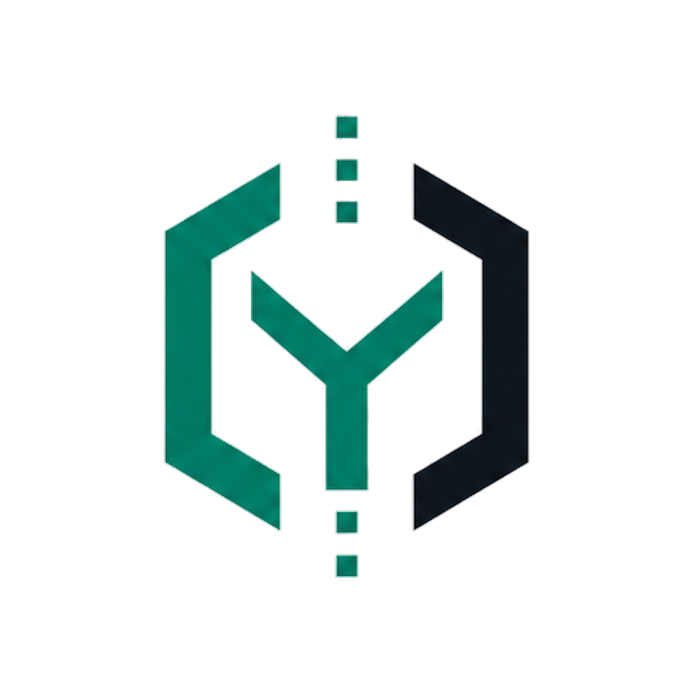

# yieldOS



Track: AI Security

yieldOS is a Claude Code security plugin that gates the risky things AI agents do before they happen: dependency installs, skill/plugin/MCP additions, vendored code, remote bootstrap commands, and instruction-file edits.

## Install

```bash
curl -fsSL https://raw.githubusercontent.com/platanus-hack/platanus-hack-26-ar-team-10/main/install.sh | sh
```

Manual install:

```bash
claude plugins marketplace add platanus-hack/platanus-hack-26-ar-team-10
claude plugins install yieldos@yieldos
```

Reload or restart Claude Code after installing. The plugin is declared from this repository's root marketplace manifest and lives at:

```text
yieldOS/plugins/yieldos
```

## Validate Locally

```bash
sh install.sh --dry-run
claude plugins validate .
claude plugins validate yieldOS/plugins/yieldos

cd yieldOS/plugins/yieldos
node --test tests/*.test.js
```

Requires Claude Code with plugin support and Node.js 18+.

## Team

- Ignacio Estevo ([@NachoEstevo](https://github.com/NachoEstevo))
- Sebastian Buffo Sempe ([@sbuffose](https://github.com/sbuffose))
- Franco Ferreira ([@frxnnk](https://github.com/frxnnk))
- Mauro Proto Cassina ([@MauroProto](https://github.com/MauroProto))
